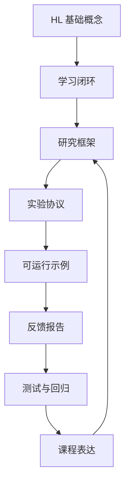

# 课程地图

本页是 HL 仓库的导航总图。读者不需要按侧栏从上到下读完；可以根据自己的角色选择路径，但每条路径最终都要回到同一个验证闭环：来源、案例、示例、报告、测试和课程页面互相对齐。

## 四条路径

| 角色 | 先读 | 再做 | 验收 |
| --- | --- | --- | --- |
| 学生 | [课程大纲](/zh-cn/syllabus/)、[学习路线](/zh-cn/stage-1/)、[学习单元矩阵](/zh-cn/appendix/learning-units) | [Lab 1](/zh-cn/slides/lab-1/)、[练习集](/zh-cn/appendix/exercises) B/C 题 | `npm run verify` + 实验记录 |
| 研究者 | [文献阅读指南](/zh-cn/appendix/reading-guide)、[研究框架](/zh-cn/theory/research-framework)、[研究命题](/zh-cn/theory/research-propositions)、[实验协议](/zh-cn/appendix/benchmark-protocol)、[评估指标矩阵](/zh-cn/appendix/evaluation-metrics) | [研究课题](/zh-cn/appendix/research-projects)、[来源登记](/zh-cn/appendix/source-registry) | case card + runnable example |
| 教师/助教 | [教师指南](/zh-cn/appendix/instructor-guide)、[课程 Rubric](/zh-cn/appendix/rubric)、[教学仓库对标](/zh-cn/appendix/course-patterns) | 选择 A/B/C/D 题，安排讲义和 Lab | Rubric 评分 + `npm run verify` |
| 编码智能体 | `llms.txt`、`/course-manifest.json` | 读 `experiments/*/latest.json` 的 `candidate_update` | 结构检查 + 完整验证 |

## 概念到实验



这张图说明本仓库的核心约束：理论页必须能落到示例或案例，示例必须能生成报告，报告必须能指导下一轮维护，维护必须被测试和课程材料约束。

## 示例到作业

| 示例 | 适合讲授的概念 | 推荐练习 |
| --- | --- | --- |
| GridWorld | 最小 HL 闭环、局部贪心失败 | A1、B1、C1 |
| Robot Soccer | 动作前提、blocked-lane probe | B2、C4、D3 |
| VizDoom Replay | 资源时机、视觉 artifact 轻量化 | B3、C3、D2 |
| Traffic Grid | 系统容量、安全约束 | B6、C2、D3 |
| Breakout Replay | 物理预测、replay probe | B4、C2、D2 |
| Ant Gait Replay | 连续控制、控制参数可审查性 | B5、C4、D2 |

练习编号见 [练习集](/zh-cn/appendix/exercises)。每个练习都要说明 baseline failure、heuristic patch、反馈报告和验证命令。

## 发布前检查

发布或提交前使用同一条命令：

```bash
npm run verify
```

它会执行：

1. VitePress theme lint。
2. 所有 Python 示例测试。
3. 六个 feedback report 重新生成。
4. 实验报告结构检查。
5. 来源登记检查。
6. course manifest 检查。
7. 课程结构检查。
8. 本地文档路由预检。
9. VitePress build。

局部排错可以使用 [本地运行与排错](/zh-cn/appendix/local-setup)，但最终验收不能绕过 `npm run verify`。

## 机器入口

面向编码智能体和外部工具的入口：

- [`/course-manifest.json`](/course-manifest.json)：核心页面、示例、public resources 和 CI gate。
- [`/course-manifest.schema.json`](/course-manifest.schema.json)：manifest 字段约束。
- [`/case-registry.json`](/case-registry.json)：案例页到来源状态、示例、学习成果和验证命令的映射。
- [`/learning-units.json`](/learning-units.json)：章节级读、跑、改、复盘闭环。
- [`/learning-outcomes.json`](/learning-outcomes.json)：能力目标到学习单元、练习、Rubric 和验证命令的映射。
- [`/checkpoint-registry.json`](/checkpoint-registry.json)：每个学习单元的阶段自测、证据和通过条件。
- [`/evaluation-metrics.json`](/evaluation-metrics.json)：研究评估维度、证据路径和验证命令。
- [`/concept-graph.json`](/concept-graph.json)：核心概念到命题、示例、讲义和验证命令的映射。
- [`/rubric.json`](/rubric.json)：评分模块、权重和验收证据。
- [`/exercise-registry.json`](/exercise-registry.json)：练习题、输入材料、示例、交付物和验收命令。
- [`/contribution-contract.json`](/contribution-contract.json)：贡献类型、证据字段、必备路径、验证命令和禁止材料。
- [`/reproducibility-checklist.json`](/reproducibility-checklist.json)：环境、示例、命题、教学、贡献和站点复现检查。
- [`/experiment-report.schema.json`](/experiment-report.schema.json)：实验报告字段约束。
- [`/llms.txt`](/llms.txt)：读写仓库时的高信号入口。

阶段性完成判断见 [完成度审计](/zh-cn/appendix/completion-audit)，不要只用单个测试或本地 HTTP 200 代替完整证据链。

这些入口让仓库不仅能给人读，也能被下一轮智能体稳定接续。
