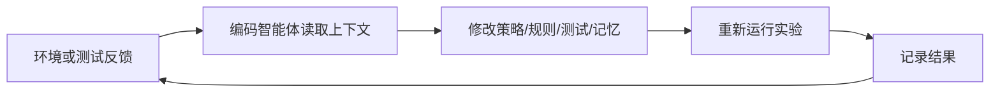

# 直觉学习：从代码规则到可维护的学习系统

直觉学习（Heuristic Learning, HL）关注一个正在变得重要的现象：当编码智能体能够持续读日志、看回放、改代码、补测试时，一个系统可以在不更新神经网络权重的情况下变强。

这个仓库的当前目标不是宣称 HL 已经成为成熟理论，而是把它整理成一个可学习、可复现、可讨论的研究课程：

- **理论积累**：从 Jiayi Weng 的公开文章出发，提炼 HL、Heuristic System、反馈闭环、遗忘与维护成本等核心概念。
- **案例沉淀**：把 Atari、MuJoCo、VizDoom、机器人足球等案例变成学习卡片。
- **动手实践**：提供最小可运行环境，让读者看到“规则如何根据反馈被维护”。
- **课程体验**：复用 EasyVibe 的 VitePress 结构，形成路线图、章节、案例、附录、讲义和 Lab 入口。

## 三类读者怎么用

| 读者 | 最短路径 | 产出 |
| --- | --- | --- |
| AI 研究者 | [研究框架](/zh-cn/theory/research-framework) -> [研究命题](/zh-cn/theory/research-propositions) -> [实验协议](/zh-cn/appendix/benchmark-protocol) | 一个有来源、反驳路径和最小实验的研究问题 |
| 工程师 | [可运行示例](/zh-cn/examples/) -> [代码导览](/zh-cn/appendix/code-tour) -> [排错决策树](/zh-cn/appendix/troubleshooting-tree) | 跑通、修改并验证一个策略维护闭环 |
| 学生 | [课程大纲](/zh-cn/syllabus/) -> [学习路线](/zh-cn/stage-1/) -> [Lab 1](/zh-cn/slides/lab-1/) | 一份包含 baseline、heuristic、报告和测试的实验记录 |

## 推荐路径

1. 先看 [课程地图](/zh-cn/course-map/)：按学生、研究者、教师或编码智能体选择路径。
2. 再看 [课程大纲](/zh-cn/syllabus/)：理解章节、案例、命令和验证产物如何对应。
3. 继续读 [学习路线](/zh-cn/stage-1/) 与 [HL 基础概念](/zh-cn/stage-2/)。
4. 对照 [RL/DL/HL](/zh-cn/stage-3/)：明确它不是反向传播替代品，而是另一类更新对象。
5. 跑 [可运行示例](/zh-cn/examples/)：用最小环境看见状态、动作、反馈和规则更新。
6. 查 [案例库](/zh-cn/cases/)：把 Jiayi 与飞书/X 资料继续沉淀成课程素材。

## 一句话定义

> HL 是一种由编码智能体维护软件结构的学习过程：反馈来自环境、测试、日志、回放或人类评价；更新对象是策略代码、状态检测器、配置、测试、记忆和实验记录，而不是神经网络权重。

## 当前最小闭环

这个闭环是全仓库的组织核心：每章都要回答“反馈是什么、更新什么、如何验证没有退化”。
